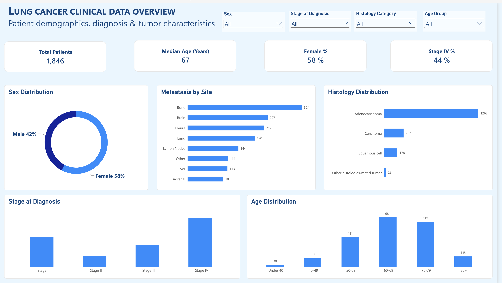

# NSCLC Clinical Data Quality and Power BI Analysis

A portfolio project combining Python-based clinical data-quality checks with a Power BI report of demographics and tumor characteristics.

## Power BI Dashboard

## Source

[AACR Project GENIE BPC NSCLC v2.0-public](https://aacrprojectgenie.org/data/bpc-nsclc-v2-0-public/), accessed via [cBioPortal](https://genie.cbioportal.org/study/summary?id=nsclc_public_genie_bpc).

Citation: The AACR Project GENIE Consortium. AACR Project GENIE: Powering Precision Medicine Through An International Consortium. Cancer Discovery. 2017;7(8):818–831.

See also [The GENIE BPC NSCLC Cohort](https://aacrjournals.org/clincancerres/article/29/17/3418/728542/The-GENIE-BPC-NSCLC-Cohort-A-Real-World-Repository), Clinical Cancer Research (2023).

Source records are not included. Follow the official [data-use and attribution guidance](https://aacrprojectgenie.org/faq/). Add the actual source access date and required AACR acknowledgment before publication.

## Methods

- Profile identifiers, duplicates, missingness, and categorical values using pandas and NumPy.
- Distinguish sample-level records from unique patients.
- Select 26 clinical fields, including all nine source metastasis-site fields.
- Apply seven exploratory QC rules and create one simulated review query per flagged sample–rule pair.
- Present patient characteristics in Power BI, with explicit attention to patient versus sample denominators.

## Results

Results below were checked against the user's saved executed notebook. They were not independently recomputed during preparation of this public copy.

| Measure | Result |
|---|---:|
| Sample records / unique samples | 2,004 |
| Unique patients | 1,846 |
| Patients with multiple samples | 143 |
| Duplicate sample IDs | 0 |
| Missing stage at diagnosis | 3 records |
| Missing sample type | 4 records |
| Records with one or more QC flags | 7 |
| Unique patients with one or more QC flags | 6 |
| Sample-record review rate | 0.35% |
| Open simulated queries | 7 |
| Records with no flags under the implemented rules | 1,997 |

The other five QC rules produced zero flags: two PD-L1 consistency checks, two stage/site-field checks, and the overall-metastasis-versus-site check.

An earlier version omitted subcutaneous tissue from the metastasis-site list and reported seven potential discrepancies. Including all nine source site fields reduced those flags to zero. This was a correction to analysis coverage, not a correction to patient records.

## Limitations

Flags are review items, not confirmed errors. Queries are simulated, remain Open, and have not been verified against clinical source documentation. Absence of flags does not establish complete or error-free data. Six sample records have missing PD-L1 testing status; the two PD-L1 consistency rules cover explicit Yes/No values only.

Counts and QC percentages in the notebook are sample-based unless labeled otherwise. Age is age at sequencing; a patient-level age summary requires a documented choice among sequencing events. Dashboard category totals and exclusions require reconciliation before presenting them as patient counts. The report screenshot and final DAX measures have not yet been added to this package.

## Run the notebook

1. Use Python 3.12 and install dependencies with `python -m pip install -r requirements.txt`. pandas 2.1.4 and NumPy 1.26.4 match the user's successful run.
2. Obtain the authorized source TSV and fully download it if stored in cloud storage.
3. Put it at `data/nsclc_public_genie_bpc_clinical_data.tsv` beside this README, or set `NSCLC_DATA_PATH` to its full path.
4. Start JupyterLab from this folder with `python -m jupyterlab`.
5. Open the notebook, restart the kernel, and run all cells.

Saved outputs are cleared in this public copy. The calculations match the supplied executed notebook; its personal Desktop path has been replaced by a portable input location. The user's working copy is unchanged.

Optional exports are disabled by default. If enabled, patient-level files go to the Git-ignored `local_exports/` folder. Do not include source records, patient-level query logs, or data-bearing Power BI files publicly unless redistribution is authorized. A .gitignore does not remove files already committed.
